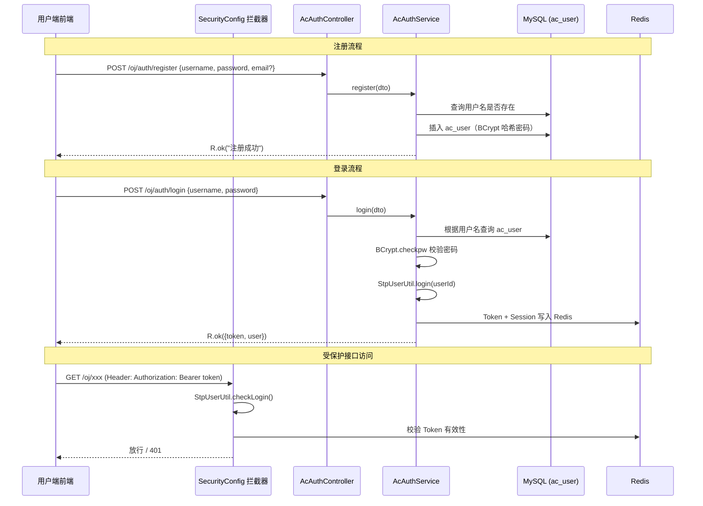
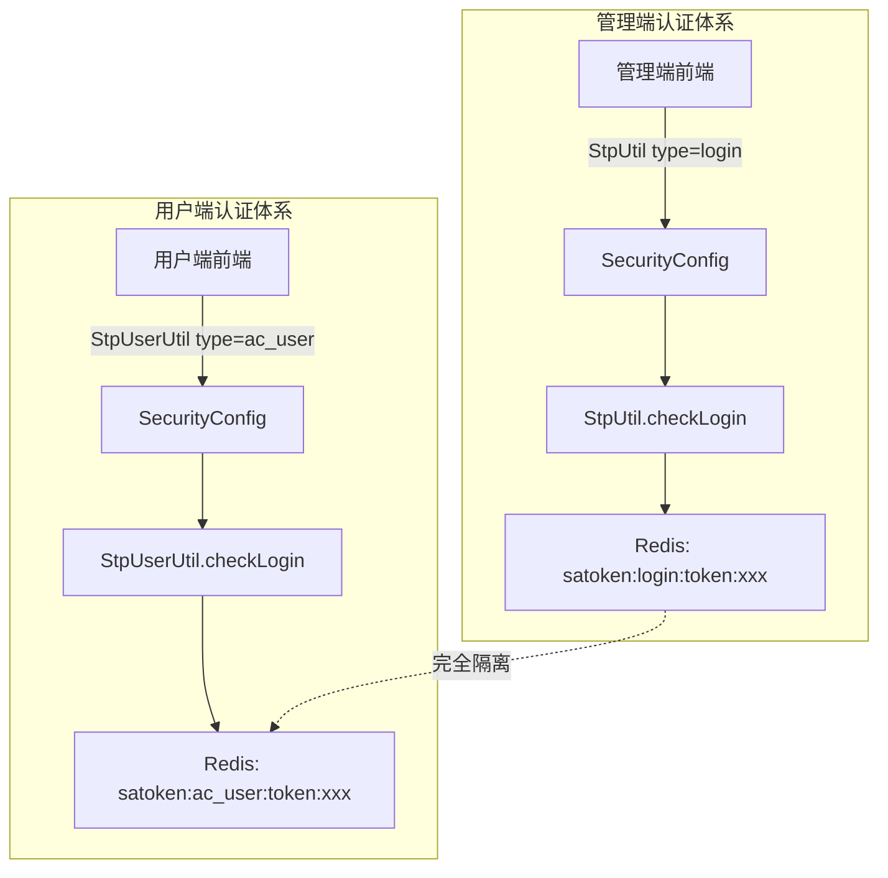

# 技术设计文档：ac_user 用户端认证体系

## 概述

本设计为 AlpenCode 用户端实现独立于管理端（sys_user / StpUtil）的认证体系。核心思路是利用 Sa-Token 的多账号体系能力，创建 `type="ac_user"` 的独立 `StpLogic`，通过自定义 `StpUserUtil` 工具类实现用户端的登录、登出、Token 校验等操作，与管理端的 `StpUtil`（type="login"）完全隔离。

认证流程覆盖：用户注册（BCrypt 哈希存储）、用户登录（生成 7 天有效 Token）、用户登出（清除 Redis 缓存）、获取当前用户信息。前端通过 `Authorization: Bearer <token>` 请求头传递 Token，后端拦截器对 `/oj/` 路径下的受保护接口进行校验。

### 设计决策

| 决策项 | 选择 | 理由 |
|--------|------|------|
| 多用户体系方案 | Sa-Token 自定义 StpLogic | 框架原生支持，零侵入，与管理端 StpUtil 天然隔离 |
| 密码存储 | BCrypt（Sa-Token 内置） | 框架已有 `BCrypt.hashpw` / `BCrypt.checkpw`，无需额外依赖 |
| 密码传输 | Base64 编码传输 | 毕设项目简化方案，生产环境应使用 RSA 非对称加密 |
| Token 有效期 | 7 天（604800 秒） | 与现有 sa-token 配置一致，用户端无需频繁登录 |
| 拦截器策略 | 在现有 SecurityConfig 中追加用户端路由规则 | 复用框架拦截器机制，放行 `/oj/auth/**`，其他 `/oj/**` 路径用 StpUserUtil 校验 |
| 接口路径 | `/oj/auth/*` | 与现有 `/oj/user/*`（管理端用户 CRUD）区分，语义清晰 |

## 架构

### 整体认证流程



### Sa-Token 多用户体系架构



## 组件与接口

### 后端组件

#### 1. StpUserUtil — 用户端 Sa-Token 工具类

位置：`org.ruoyi.common.satoken.utils.StpUserUtil`

```java
/**
 * 用户端认证工具类（ac_user 专用）
 * 基于 Sa-Token 多账号体系，type = "ac_user"
 */
public class StpUserUtil {
    public static final String TYPE = "ac_user";
    public static StpLogic stpLogic = new StpLogic(TYPE);

    // 核心方法：login, logout, checkLogin, getLoginIdAsInt,
    // getTokenValue, isLogin, getTokenSession
}
```

#### 2. AcAuthController — 用户端认证控制器

位置：`org.ruoyi.system.controller.oj.AcAuthController`

| 方法 | 路径 | 说明 |
|------|------|------|
| `POST register` | `/oj/auth/register` | 用户注册 |
| `POST login` | `/oj/auth/login` | 用户登录 |
| `POST logout` | `/oj/auth/logout` | 用户登出 |
| `GET info` | `/oj/auth/info` | 获取当前用户信息 |

#### 3. IAcAuthService / AcAuthServiceImpl — 认证业务服务

位置：`org.ruoyi.system.service.oj.IAcAuthService` / `org.ruoyi.system.service.oj.impl.AcAuthServiceImpl`

```java
public interface IAcAuthService {
    /** 用户注册 */
    void register(AcUserRegisterDTO dto);

    /** 用户登录，返回 Token + 用户信息 */
    AcLoginVo login(AcUserLoginDTO dto);

    /** 用户登出 */
    void logout();

    /** 获取当前登录用户信息 */
    AcUserVo getLoginUserInfo();
}
```

#### 4. SecurityConfig 拦截器扩展

在现有 `SecurityConfig.addInterceptors` 中追加用户端路由校验规则：

```
对 /oj/** 路径（排除 /oj/auth/login, /oj/auth/register）：
  → StpUserUtil.checkLogin()
```

### 前端组件

#### 1. API 层调整

将 `api/auth.ts` 中的接口路径从 `/oj/user/*` 改为 `/oj/auth/*`：

| 函数 | 路径 | 方法 |
|------|------|------|
| `login` | `/oj/auth/login` | POST |
| `register` | `/oj/auth/register` | POST |
| `logout` | `/oj/auth/logout` | POST |
| `getUserInfo` | `/oj/auth/info` | GET |

#### 2. 请求拦截器

已有实现（`api/request.ts`）：自动在请求头注入 `Authorization: Bearer <token>`，401 时清除本地 Token 并跳转登录页。无需修改。

#### 3. 用户状态管理

已有实现（`store/user.ts`）：`token` 存储在 localStorage（key: `ac_token`），`user` 存储在内存。无需修改。


## 数据模型

### 数据库表（已有，无需修改）

`ac_user` 表结构：

| 字段 | 类型 | 说明 |
|------|------|------|
| id | int AUTO_INCREMENT PK | 用户ID |
| username | varchar(50) | 用户名 |
| password_hash | varchar(255) | BCrypt 哈希密码 |
| email | varchar(100) | 邮箱（可选） |
| status | int | 状态（0=正常 1=停用） |
| is_delete | tinyint | 逻辑删除（0=存在 2=删除） |
| created_at | datetime | 创建时间 |
| updated_at | datetime | 更新时间 |

> 注：需求文档中提到 ac_user 表有 `role` 字段（enum），但根据关键技术决策第 7 条，不需要角色相关设计。现有实体类 `AcUser.java` 中也没有 role 字段，status 字段已存在。

### 实体类（已有）

`AcUser.java` — 已存在，字段与表结构对应，无需修改。

### DTO 类

#### AcUserRegisterDTO（已有，需微调）

当前实现中 email 字段标注了 `@NotBlank`，但需求要求邮箱为可选字段。需移除 email 的 `@NotBlank` 校验。

```java
@Data
public class AcUserRegisterDTO implements Serializable {
    @NotBlank(message = "用户名不能为空")
    @Size(min = 3, max = 50, message = "用户名长度必须在3-50之间")
    private String username;

    @NotBlank(message = "密码不能为空")
    @Size(min = 6, max = 20, message = "密码长度必须在6-20之间")
    private String password;

    @Email(message = "邮箱格式不正确")
    private String email;  // 可选，移除 @NotBlank
}
```

#### AcUserLoginDTO（已有，无需修改）

```java
@Data
public class AcUserLoginDTO implements Serializable {
    @NotBlank(message = "用户名不能为空")
    private String username;

    @NotBlank(message = "密码不能为空")
    private String password;
}
```

### VO 类

#### AcLoginVo（新增）

登录成功后的返回对象：

```java
@Data
public class AcLoginVo implements Serializable {
    /** 用户端 Token */
    private String token;
    /** 用户基本信息 */
    private AcUserVo user;
}
```

#### AcUserVo（已有，无需修改）

已包含 `id, username, email, status, createdAt, updatedAt`，不含 `passwordHash`，满足需求 4 的要求。

### Redis 数据结构

Sa-Token 自动管理，key 格式：

| Key 模式 | 说明 |
|----------|------|
| `satoken:ac_user:token:{tokenValue}` | Token → 用户ID 映射 |
| `satoken:ac_user:session:{userId}` | 用户 Session 数据 |
| `satoken:ac_user:last-activity:{tokenValue}` | Token 最后活跃时间 |

与管理端的 `satoken:login:token:*` 完全隔离，互不干扰。


## 正确性属性（Correctness Properties）

*正确性属性是指在系统所有合法执行路径中都应成立的特征或行为——本质上是对系统应做什么的形式化陈述。属性是连接人类可读规格说明与机器可验证正确性保证之间的桥梁。*

### Property 1: 注册-查询用户信息往返一致性

*对于任意*合法的用户名（3-50 字符）和密码（6-20 字符），以及可选的邮箱，注册成功后登录并获取当前用户信息，返回的用户名和邮箱应与注册时提交的一致，且返回数据中不应包含密码哈希字段。

**Validates: Requirements 1.1, 1.2, 4.1**

### Property 2: 用户名唯一性约束

*对于任意*已注册的用户名，使用相同用户名再次注册应被拒绝并返回"用户名已存在"错误，且 ac_user 表中该用户名的记录数不变。

**Validates: Requirements 1.3**

### Property 3: 注册输入校验拒绝非法长度

*对于任意*长度不在 3-50 范围内的用户名字符串，或长度不在 6-20 范围内的密码字符串，注册请求应被拒绝，且 ac_user 表中不应新增记录。

**Validates: Requirements 1.4, 1.5**

### Property 4: 登录-Token 有效性往返

*对于任意*已注册且状态正常的用户，使用正确的用户名和密码（经 Base64 编码传输）登录后，返回的 Token 应非空，且使用该 Token 调用 StpUserUtil.getLoginIdAsInt() 应返回该用户的 ID，Session 中应包含正确的用户 ID 和用户名。

**Validates: Requirements 2.1, 1.6, 2.5**

### Property 5: 不存在的用户名登录失败

*对于任意*不存在于 ac_user 表中的用户名，登录请求应抛出包含"用户名不存在"信息的异常。

**Validates: Requirements 2.2**

### Property 6: 错误密码登录失败

*对于任意*已注册用户和任意与其真实密码不同的密码字符串，登录请求应抛出包含"密码错误"信息的异常。

**Validates: Requirements 2.3**

### Property 7: 停用账号登录失败

*对于任意*状态为停用（status=1）的用户，即使提供正确的用户名和密码，登录请求应抛出包含"账号已被停用"信息的异常。

**Validates: Requirements 2.4**

### Property 8: 登出使 Token 失效

*对于任意*已登录用户，执行登出操作后，其之前获取的 Token 应不再有效（StpUserUtil.getLoginIdByToken 返回 null 或抛出未登录异常）。

**Validates: Requirements 3.1**

### Property 9: 跨体系 Token 隔离

*对于任意*用户端生成的 Token，使用 StpUtil（管理端）校验应失败；*对于任意*管理端生成的 Token，使用 StpUserUtil（用户端）校验应失败。两套认证体系的 Token 互不承认。

**Validates: Requirements 5.2, 5.3**

## 错误处理

### 错误码与响应格式

所有接口统一使用框架的 `R<T>` 响应体：

| 场景 | HTTP 状态码 | code | msg |
|------|------------|------|-----|
| 注册成功 | 200 | 200 | "注册成功" |
| 用户名已存在 | 200 | 500 | "用户名已存在" |
| 用户名长度不合法 | 200 | 500 | "用户名长度必须在3-50之间" |
| 密码长度不合法 | 200 | 500 | "密码长度必须在6-20之间" |
| 登录成功 | 200 | 200 | "操作成功" |
| 用户名不存在 | 200 | 500 | "用户名不存在" |
| 密码错误 | 200 | 500 | "密码错误" |
| 账号已被停用 | 200 | 500 | "账号已被停用" |
| 登出成功 | 200 | 200 | "操作成功" |
| 未登录访问受保护接口 | 200 | 401 | "未登录" |

### 异常处理策略

- 参数校验异常（`@Valid` 触发的 `MethodArgumentNotValidException`）：由框架全局异常处理器捕获，返回校验错误信息
- 业务异常（`ServiceException`）：在 Service 层抛出，由全局异常处理器捕获
- Sa-Token 未登录异常（`NotLoginException`）：由框架全局异常处理器捕获，返回 401
- 登出时的未登录异常：在 Service 层 catch 并忽略，实现幂等

## 测试策略

### 单元测试

使用 JUnit 5 + Mockito，重点覆盖：

- **AcAuthServiceImpl 注册逻辑**：mock AcUserMapper，验证 BCrypt 哈希调用、用户名重复检查、邮箱可选存储
- **AcAuthServiceImpl 登录逻辑**：mock 数据库查询，验证各种错误分支（用户不存在、密码错误、账号停用）
- **AcAuthServiceImpl 登出逻辑**：验证幂等处理（未登录时不抛异常）
- **边缘用例**：空字符串用户名、超长密码、特殊字符用户名

### 属性测试（Property-Based Testing）

使用 **jqwik**（Java 属性测试库），每个属性测试至少运行 100 次迭代。

每个测试用 `@Tag` 注解标注对应的设计属性：

```java
// Feature: ac-user-auth, Property 1: 注册-查询用户信息往返一致性
@Property(tries = 100)
void registerThenGetInfoRoundTrip(@ForAll @StringLength(min=3, max=50) String username, ...) { ... }
```

属性测试与正确性属性的对应关系：

| 属性 | 测试方法 | 生成策略 |
|------|----------|----------|
| Property 1 | 注册→登录→获取信息→比对 | 随机用户名(3-50字符) + 随机密码(6-20字符) + 可选随机邮箱 |
| Property 2 | 注册→相同用户名再注册→断言失败 | 随机用户名 |
| Property 3 | 生成非法长度输入→注册→断言拒绝 | 长度<3或>50的用户名 + 长度<6或>20的密码 |
| Property 4 | 注册→Base64编码密码→登录→验证Token和Session | 随机合法凭证 |
| Property 5 | 生成随机不存在用户名→登录→断言异常 | 随机字符串（确保不在数据库中） |
| Property 6 | 注册→用错误密码登录→断言异常 | 随机合法用户 + 随机错误密码 |
| Property 7 | 注册→设置status=1→登录→断言异常 | 随机合法用户 |
| Property 8 | 注册→登录→登出→验证Token失效 | 随机合法用户 |
| Property 9 | 用户端登录→用StpUtil校验→断言失败 | 随机合法用户 |

### 集成测试

使用 Spring Boot Test + `@SpringBootTest`，验证完整的 HTTP 请求链路：

- 注册→登录→携带Token访问受保护接口→登出→Token失效
- 未携带Token访问受保护接口→401
- `/oj/auth/login` 和 `/oj/auth/register` 无需Token即可访问
- 接口路径正确性（6.1-6.4）

