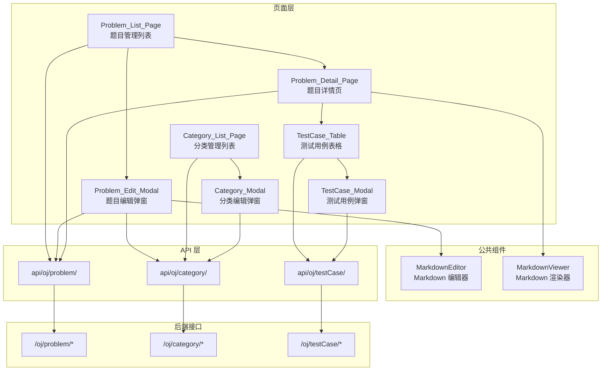
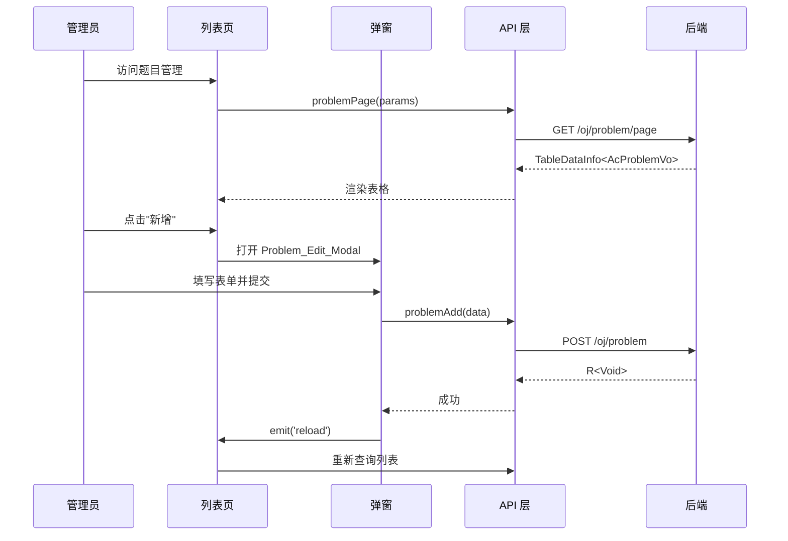

# 技术设计文档：管理端题目管理

## 概述

本设计文档描述 AlpenCode 管理端的题目管理与测试用例管理前端功能的技术实现方案。该功能为管理员提供题目 CRUD、分类管理、测试用例管理的完整管理界面，基于 Vue 3 + TypeScript + Ant Design Vue + Vben Admin 框架，遵循现有管理端页面的代码风格。

后端 API 已全部实现（`/oj/problem`、`/oj/category`、`/oj/testCase`），本设计聚焦于前端 API 层封装、页面组件开发、Markdown 编辑器集成三个核心部分。

## 架构

### 整体组件架构



### 数据流



### 页面导航关系

- 题目管理列表页 → 点击"详情" → 题目详情页（路由跳转，携带 problemId）
- 题目详情页 → 点击"返回" → 题目管理列表页（router.back()）
- 分类管理列表页为独立菜单入口，与题目管理平级

## 组件与接口

### 文件结构

```
ruoyi-admin/apps/web-antd/src/
├── api/oj/
│   ├── problem/
│   │   ├── index.ts              # 题目 API 函数
│   │   └── model.d.ts            # Problem 类型定义
│   ├── category/
│   │   ├── index.ts              # 分类 API 函数
│   │   └── model.d.ts            # ProblemCategory 类型定义
│   └── testCase/
│       ├── index.ts              # 测试用例 API 函数
│       └── model.d.ts            # TestCase 类型定义
├── components/markdown/
│   ├── MarkdownEditor.vue        # Markdown 编辑器组件（基于 md-editor-v3）
│   └── index.ts                  # 导出
├── views/oj/
│   ├── problem/
│   │   ├── index.vue             # 题目管理列表页
│   │   ├── data.tsx              # 表格列、筛选表单、弹窗表单 schema
│   │   ├── problem-modal.vue     # 题目编辑弹窗
│   │   └── detail.vue            # 题目详情页（含测试用例管理）
│   ├── category/
│   │   ├── index.vue             # 分类管理列表页
│   │   ├── data.ts               # 表格列、弹窗表单 schema
│   │   └── category-modal.vue    # 分类编辑弹窗
│   └── testCase/
│       ├── data.ts               # 测试用例表格列、弹窗表单 schema
│       └── testCase-modal.vue    # 测试用例编辑弹窗
```

### 各文件职责

| 文件 | 职责 |
|------|------|
| `api/oj/problem/model.d.ts` | 定义 `Problem` 接口，映射后端 `AcProblemVo` |
| `api/oj/problem/index.ts` | 封装 `problemPage`、`problemInfo`、`problemAdd`、`problemUpdate`、`problemRemove` |
| `api/oj/category/model.d.ts` | 定义 `ProblemCategory` 接口，映射后端 `AcProblemCategoryVo` |
| `api/oj/category/index.ts` | 封装 `categoryPage`、`categoryList`、`categoryInfo`、`categoryAdd`、`categoryUpdate`、`categoryRemove` |
| `api/oj/testCase/model.d.ts` | 定义 `TestCase` 接口，映射后端 `AcTestCaseVo` |
| `api/oj/testCase/index.ts` | 封装 `testCasePage`、`testCaseInfo`、`testCaseAdd`、`testCaseUpdate`、`testCaseRemove` |
| `views/oj/problem/index.vue` | 题目列表页，使用 `useVbenVxeGrid` + `useVbenModal`，提供筛选、新增、编辑、详情、删除操作 |
| `views/oj/problem/data.tsx` | 定义 `querySchema`（筛选表单）、`columns`（表格列含难度字典渲染）、`modalSchema`（弹窗表单） |
| `views/oj/problem/problem-modal.vue` | 题目编辑弹窗，使用原生 Form + MarkdownEditor，支持新增/编辑模式 |
| `views/oj/problem/detail.vue` | 题目详情页，只读展示题目信息 + Markdown 渲染 + 嵌入测试用例表格 |
| `views/oj/category/index.vue` | 分类列表页，标准 CRUD 列表 |
| `views/oj/category/data.ts` | 分类表格列和弹窗表单 schema |
| `views/oj/category/category-modal.vue` | 分类编辑弹窗 |
| `views/oj/testCase/data.ts` | 测试用例表格列和弹窗表单 schema |
| `views/oj/testCase/testCase-modal.vue` | 测试用例编辑弹窗，自动绑定当前 problemId |
| `components/markdown/MarkdownEditor.vue` | 封装 md-editor-v3，支持 v-model 双向绑定和实时预览 |

### API 层接口设计

#### 题目 API（api/oj/problem/index.ts）

| 函数 | HTTP 方法 | 路径 | 参数 | 返回 |
|------|-----------|------|------|------|
| `problemPage` | GET | `/oj/problem/page` | `PageQuery`（含 title、difficulty、status、categoryId） | `Problem[]` |
| `problemInfo` | GET | `/oj/problem/{id}` | `ID` | `Problem` |
| `problemAdd` | POST | `/oj/problem` | `Partial<Problem>` | `void` |
| `problemUpdate` | POST | `/oj/problem/edit` | `Partial<Problem>` | `void` |
| `problemRemove` | DELETE | `/oj/problem/{ids}` | `IDS` | `void` |

注意：`problemUpdate` 使用 `requestClient.postWithMsg` 而非 `putWithMsg`，因为后端修改接口使用 POST。

#### 分类 API（api/oj/category/index.ts）

| 函数 | HTTP 方法 | 路径 | 参数 | 返回 |
|------|-----------|------|------|------|
| `categoryPage` | GET | `/oj/category/page` | `PageQuery` | `ProblemCategory[]` |
| `categoryList` | GET | `/oj/category/list` | 无 | `ProblemCategory[]` |
| `categoryInfo` | GET | `/oj/category/{id}` | `ID` | `ProblemCategory` |
| `categoryAdd` | POST | `/oj/category` | `Partial<ProblemCategory>` | `void` |
| `categoryUpdate` | POST | `/oj/category/edit` | `Partial<ProblemCategory>` | `void` |
| `categoryRemove` | DELETE | `/oj/category/{ids}` | `IDS` | `void` |

#### 测试用例 API（api/oj/testCase/index.ts）

| 函数 | HTTP 方法 | 路径 | 参数 | 返回 |
|------|-----------|------|------|------|
| `testCasePage` | GET | `/oj/testCase/page` | `PageQuery`（含 problemId） | `TestCase[]` |
| `testCaseInfo` | GET | `/oj/testCase/{id}` | `ID` | `TestCase` |
| `testCaseAdd` | POST | `/oj/testCase` | `Partial<TestCase>` | `void` |
| `testCaseUpdate` | POST | `/oj/testCase/edit` | `Partial<TestCase>` | `void` |
| `testCaseRemove` | DELETE | `/oj/testCase/{ids}` | `IDS` | `void` |

### Markdown 编辑器技术选型

选用 `md-editor-v3`，理由：
- 原生支持 Vue 3，提供 `MdEditor`（编辑器）和 `MdPreview`（只读渲染）两个组件
- 内置并排实时预览，满足需求 2.6
- 支持 v-model 双向绑定，与 Vben Admin 表单体系兼容
- 轻量，无需额外配置 Markdown 解析器
- npm 周下载量稳定，社区活跃

安装依赖：`pnpm add md-editor-v3`（在 `ruoyi-admin/apps/web-antd/` 目录下执行）

MarkdownEditor 组件封装要点：
- 接收 `modelValue` prop，emit `update:modelValue` 事件，实现 v-model
- 在 problem-modal.vue 中直接使用 `<MarkdownEditor v-model="formData.description" />`
- 在 detail.vue 中使用 `<MdPreview :modelValue="problem.description" />` 做只读渲染

### 字典配置

需要在后端 `sys_dict_type` 和 `sys_dict_data` 表中配置难度字典：

- 字典类型：`ac_difficulty`
- 字典数据：
  - `1` → 简单（list_class: `success`，绿色标签）
  - `2` → 中等（list_class: `warning`，橙色标签）
  - `3` → 困难（list_class: `danger`，红色标签）

同时需要在 `DictEnum` 中新增：
```typescript
AC_DIFFICULTY = 'ac_difficulty', // OJ 题目难度
```

表格列中使用 `renderDict(row.difficulty, DictEnum.AC_DIFFICULTY)` 渲染难度标签。

### 关键设计决策

| 决策 | 选择 | 理由 |
|------|------|------|
| Markdown 编辑器 | md-editor-v3 | 原生 Vue 3 支持，内置预览，轻量 |
| 题目弹窗表单 | 原生 Form（非 useVbenForm） | 需要集成 MarkdownEditor 自定义组件，原生 Form 更灵活（参考 notice-modal.vue 模式） |
| 测试用例管理位置 | 嵌入题目详情页 | 测试用例与题目强关联，在同一上下文中管理更高效 |
| 详情页路由 | 路由跳转（非弹窗） | 详情页内容较多（题目信息 + 测试用例表格），弹窗空间不足 |
| 修改接口 HTTP 方法 | POST（非 PUT） | 后端统一使用 `@PostMapping("/edit")`，前端使用 `postWithMsg` |


## 数据模型

### TypeScript 接口定义

#### Problem（题目）

```typescript
// api/oj/problem/model.d.ts
export interface ProblemCategory {
  id: number;
  name: string;
}

export interface Problem {
  id: number;
  title: string;
  description: string;
  difficulty: number;          // 1=简单 2=中等 3=困难
  timeLimit: number;           // 时间限制(ms)
  memoryLimit: number;         // 内存限制(MB)
  submitCount: number;
  acCount: number;
  status: number;
  createdAt: string;
  updatedAt: string;
  categories: ProblemCategory[];  // 关联分类列表
  categoryIds?: number[];         // 提交时使用的分类ID数组
}
```

#### ProblemCategory（题目分类）

```typescript
// api/oj/category/model.d.ts
export interface ProblemCategory {
  id: number;
  name: string;
  createdAt: string;
  updatedAt: string;
}
```

#### TestCase（测试用例）

```typescript
// api/oj/testCase/model.d.ts
export interface TestCase {
  id: number;
  problemId: number;
  input: string;
  expectedOutput: string;
  isSample: number;            // 0=隐藏 1=公开
  sort: number;
  status: number;
  createdAt: string;
  updatedAt: string;
}
```

### 后端数据模型映射

| 前端字段 | 后端 VO 字段 | 说明 |
|----------|-------------|------|
| `Problem.categories` | `AcProblemVo.categories` | 查询时返回关联分类列表 |
| `Problem.categoryIds` | `AcProblemDTO.categoryIds` | 新增/修改时提交分类ID数组 |
| `TestCase.problemId` | `AcTestCaseDTO.problemId` | 新增测试用例时绑定题目ID |

### 后端 API 端点汇总

| 端点 | 方法 | 说明 | 请求参数 | 响应 |
|------|------|------|----------|------|
| `/oj/problem/page` | GET | 分页查询题目 | title, difficulty, status, categoryId, pageNum, pageSize | `TableDataInfo<AcProblemVo>` |
| `/oj/problem/{id}` | GET | 题目详情 | id | `R<AcProblemVo>`（含 categories） |
| `/oj/problem` | POST | 新增题目 | AcProblemDTO（含 categoryIds） | `R<Void>` |
| `/oj/problem/edit` | POST | 修改题目 | AcProblemDTO（含 id, categoryIds） | `R<Void>` |
| `/oj/problem/{ids}` | DELETE | 删除题目 | ids | `R<Void>` |
| `/oj/category/page` | GET | 分页查询分类 | pageNum, pageSize | `TableDataInfo<AcProblemCategoryVo>` |
| `/oj/category/list` | GET | 全量分类列表 | 无 | `R<List<AcProblemCategoryVo>>` |
| `/oj/category/{id}` | GET | 分类详情 | id | `R<AcProblemCategoryVo>` |
| `/oj/category` | POST | 新增分类 | AcProblemCategoryDTO | `R<Void>` |
| `/oj/category/edit` | POST | 修改分类 | AcProblemCategoryDTO（含 id） | `R<Void>` |
| `/oj/category/{ids}` | DELETE | 删除分类 | ids | `R<Void>` |
| `/oj/testCase/page` | GET | 分页查询测试用例 | problemId, pageNum, pageSize | `TableDataInfo<AcTestCaseVo>` |
| `/oj/testCase/{id}` | GET | 测试用例详情 | id | `R<AcTestCaseVo>` |
| `/oj/testCase` | POST | 新增测试用例 | AcTestCaseDTO（含 problemId） | `R<Void>` |
| `/oj/testCase/edit` | POST | 修改测试用例 | AcTestCaseDTO（含 id） | `R<Void>` |
| `/oj/testCase/{ids}` | DELETE | 删除测试用例 | ids | `R<Void>` |


## 正确性属性

*属性是指在系统所有有效执行中都应保持为真的特征或行为——本质上是关于系统应该做什么的形式化陈述。属性是人类可读规范与机器可验证正确性保证之间的桥梁。*

### 属性 1：难度字典渲染正确性

*对于任意*难度值（1、2、3），通过 `renderDict` 函数和 `ac_difficulty` 字典渲染后，应产生对应的标签（1→简单/绿色，2→中等/橙色，3→困难/红色），且不应产生空或未定义的输出。

**验证需求：1.4**

### 属性 2：编辑模式数据预填一致性

*对于任意*实体（题目、测试用例、分类），当以编辑模式打开弹窗时，从后端 API 获取的数据应完整映射到表单的所有对应字段中，即表单字段值应与 API 返回的实体字段值一一对应。

**验证需求：1.7, 2.2, 4.4**

### 属性 3：新增/编辑模式 API 路由正确性

*对于任意*实体（题目、分类、测试用例），新增模式下提交表单应调用 `POST /oj/{entity}` 接口，编辑模式下提交表单应调用 `POST /oj/{entity}/edit` 接口且请求体中包含实体 ID。两种模式不应调用错误的端点。

**验证需求：2.3, 2.4, 4.6, 4.7, 5.6, 5.7**

### 属性 4：必填字段校验阻止提交

*对于任意*表单状态，当任一必填字段（题目标题、题目描述、难度、测试用例输入数据、期望输出、分类名称）为空或仅包含空白字符时，表单提交应被阻止，且对应字段应显示校验错误信息。

**验证需求：2.7**

### 属性 5：操作成功后列表刷新

*对于任意*成功的增删改操作（题目、分类、测试用例），操作完成后弹窗应关闭，且对应的列表表格应重新查询数据以反映最新状态。

**验证需求：2.5, 4.9, 5.10**

### 属性 6：筛选参数透传完整性

*对于任意*筛选条件组合（题目标题、难度、状态、分类ID），触发搜索时 API 调用的请求参数应包含所有非空筛选字段的值，且分页参数（pageNum、pageSize）应正确传递。

**验证需求：1.3, 6.6**

### 属性 7：详情页导航参数正确性

*对于任意*题目行，点击"详情"按钮后路由跳转的目标路径应包含该题目的 ID，且详情页应使用该 ID 调用后端接口获取完整题目数据。

**验证需求：1.8, 3.1**

### 属性 8：批量删除 ID 收集正确性

*对于任意*选中的行集合，批量删除操作应将所有选中行的 ID 收集并传递给删除 API，且传递的 ID 数量应等于选中行的数量。

**验证需求：1.9, 5.9**

### 属性 9：测试用例绑定题目 ID

*对于任意*在题目详情页中新增的测试用例，提交到后端的数据应自动包含当前题目的 problemId，无需用户手动输入。

**验证需求：4.2, 4.6**

### 属性 10：API 层模式一致性

*对于任意* API 函数，应使用 `requestClient` 的对应方法（get/postWithMsg/deleteWithMsg），且分页查询函数的参数类型应为 `PageQuery`，遵循与现有模块（如 notice）相同的封装模式。

**验证需求：6.5, 6.6**

### 属性 11：TypeScript 接口与后端 VO 字段对齐

*对于任意*前端 TypeScript 接口（Problem、ProblemCategory、TestCase），其字段集合应覆盖后端对应 VO（AcProblemVo、AcProblemCategoryVo、AcTestCaseVo）的所有字段，确保数据传输无遗漏。

**验证需求：6.1**

## 错误处理

### 网络错误

- API 层使用 `requestClient` 统一处理网络错误，框架已内置全局错误提示（message/notification）
- 弹窗提交失败时，`modalApi.modalLoading(false)` 恢复按钮状态，不关闭弹窗，允许用户重试
- 列表页查询失败时，VxeTable 的 proxyConfig 会自动处理加载状态

### 表单校验错误

- 必填字段为空时，`Form.useForm` 的 `validate()` 方法抛出异常，在 `catch` 中捕获并阻止提交
- 校验错误信息通过 `validateInfos` 绑定到对应的 `FormItem` 上显示

### 数据不存在

- 编辑弹窗打开时，如果 `problemInfo(id)` 返回 null，应提示"题目不存在"并关闭弹窗
- 详情页加载时，如果题目不存在，应提示错误并导航回列表页

### 删除操作

- 单行删除使用 `Popconfirm` 气泡确认框，防止误操作
- 批量删除使用 `Modal.confirm` 对话框，显示选中数量
- 删除失败时（如题目已被引用），后端返回错误信息，前端通过 `requestClient` 全局提示

### 分类数据加载

- 题目编辑弹窗和筛选表单中的分类下拉数据通过 `categoryList()` 接口获取
- 如果分类接口调用失败，下拉框显示为空，不阻塞其他表单字段的填写

## 测试策略

### 双重测试方法

本功能采用单元测试 + 属性测试的双重测试策略：

- **单元测试**：验证具体示例、边界情况和错误条件
- **属性测试**：验证跨所有输入的通用属性

两者互补，单元测试捕获具体 bug，属性测试验证通用正确性。

### 属性测试

使用 `fast-check` 作为属性测试库（Vue/TypeScript 生态中最成熟的 PBT 库）。

配置要求：
- 每个属性测试至少运行 100 次迭代
- 每个测试用注释标注对应的设计文档属性
- 标注格式：**Feature: admin-problem-management, Property {number}: {property_text}**
- 每个正确性属性由一个属性测试实现

属性测试重点覆盖：
- 属性 1：生成随机难度值，验证字典渲染输出
- 属性 3：生成随机实体和模式（add/edit），验证 API 路由选择
- 属性 4：生成随机表单状态（含空值/空白字符），验证校验拦截
- 属性 6：生成随机筛选条件组合，验证参数透传
- 属性 8：生成随机行选择集合，验证 ID 收集
- 属性 11：对比前端接口定义与后端 VO 字段列表

### 单元测试

单元测试重点覆盖：
- API 函数调用正确的 HTTP 方法和路径（示例测试）
- 表格列配置包含所有必需列（示例测试）
- 筛选表单 schema 包含所有必需字段（示例测试）
- 弹窗表单 schema 包含所有必需字段和默认值（示例测试）
- 删除操作前显示确认框（示例测试）
- 分类下拉数据加载失败时的降级处理（边界情况）
- 详情页题目不存在时的错误处理（边界情况）

### 测试文件结构

```
tests/oj/
├── api/
│   ├── problem-api.test.ts       # 题目 API 单元测试
│   ├── category-api.test.ts      # 分类 API 单元测试
│   └── testCase-api.test.ts      # 测试用例 API 单元测试
├── views/
│   ├── problem-list.test.ts      # 题目列表页测试
│   ├── problem-modal.test.ts     # 题目弹窗测试
│   ├── problem-detail.test.ts    # 题目详情页测试
│   ├── category-list.test.ts     # 分类列表页测试
│   └── testCase-table.test.ts    # 测试用例表格测试
└── properties/
    ├── dict-render.prop.test.ts  # 属性 1：字典渲染
    ├── api-routing.prop.test.ts  # 属性 3：API 路由
    ├── validation.prop.test.ts   # 属性 4：表单校验
    ├── filter-params.prop.test.ts # 属性 6：筛选参数
    ├── batch-delete.prop.test.ts # 属性 8：批量删除
    └── type-alignment.prop.test.ts # 属性 11：类型对齐
```
