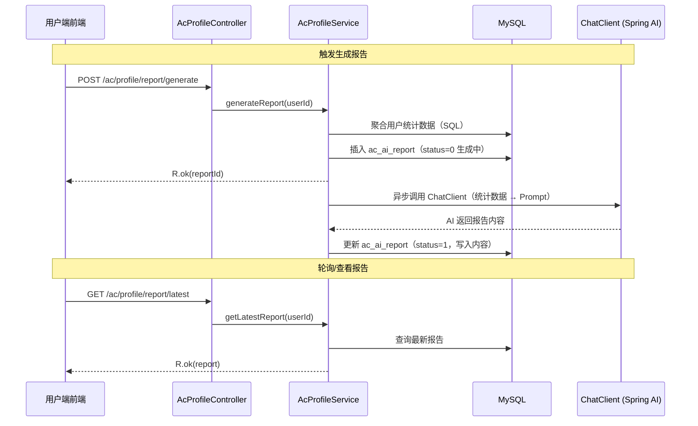
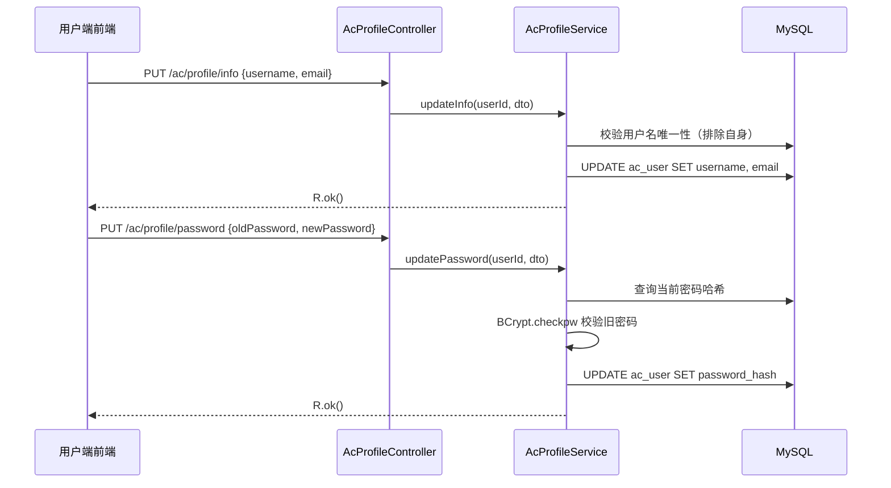

# 技术设计文档：个人中心 + AI 能力总结报告

## 概述

本设计为 AlpenCode 用户端实现个人中心模块，包含两大功能：
1. 个人信息管理（修改用户名、邮箱、密码）
2. AI 能力总结报告（全屏滚动卡片式沉浸体验，ECharts 可视化）

核心流程：用户在个人中心点击"生成报告" → 后端异步聚合统计数据并调用 AI → 报告存入 ac_ai_report 表 → 用户进入全屏报告页查看。

### 设计决策

| 决策项 | 选择 | 理由 |
|--------|------|------|
| AI 报告生成时机 | 用户主动触发，异步生成存表 | 避免每次查看都等 AI，体验更好 |
| 报告存储 | 新建 ac_ai_report 表 | 报告内容较大，需持久化，支持历史查看 |
| 统计数据 | 实时聚合 SQL + 快照存报告 | 统计接口实时查，报告生成时快照一份 |
| 前端图表 | ECharts | 用户指定，生态成熟 |
| 报告交互 | 全屏滚动卡片（CSS scroll-snap） | 用户指定，类似年终总结沉浸体验 |
| AI 报告内容格式 | JSON 结构化 | 便于前端按卡片拆分渲染，而非纯文本 |
| 密码修改 | 旧密码 + 新密码验证 | 安全性基本保障 |

## 架构

### AI 报告生成流程



### 个人信息修改流程



## 组件与接口

### 后端组件

#### 1. AcProfileController — 个人中心控制器

位置：`org.ruoyi.system.controller.oj.AcProfileController`

| 方法 | 路径 | 说明 |
|------|------|------|
| `PUT updateInfo` | `/ac/profile/info` | 修改用户名和邮箱 |
| `PUT updatePassword` | `/ac/profile/password` | 修改密码 |
| `GET stats` | `/ac/profile/stats` | 获取用户刷题统计 |
| `POST generateReport` | `/ac/profile/report/generate` | 触发生成 AI 报告 |
| `GET latestReport` | `/ac/profile/report/latest` | 查询最新报告 |

#### 2. IAcProfileService / AcProfileServiceImpl — 个人中心业务服务

位置：`org.ruoyi.system.service.oj.IAcProfileService` / `impl.AcProfileServiceImpl`

复用 `IAcUserService` 处理用户信息修改，新增统计和报告逻辑。

```java
public interface IAcProfileService {
    /** 修改用户信息（复用 AcUserDTO） */
    void updateInfo(Integer userId, AcUserDTO dto);

    /** 修改密码 */
    void updatePassword(Integer userId, AcPasswordUpdateDTO dto);

    /** 获取用户刷题统计数据 */
    AcUserStatsVo getStats(Integer userId);

    /** 触发生成 AI 报告（异步） */
    Integer generateReport(Integer userId);

    /** 查询最新报告 */
    AcAiReportVo getLatestReport(Integer userId);
}
```

#### 3. AcAiReportMapper — 报告数据访问

位置：`org.ruoyi.system.mapper.AcAiReportMapper`

继承 `BaseMapper<AcAiReport>`，额外提供统计聚合的自定义 SQL。

### DTO 类

#### AcUserDTO（复用已有，不新建）

修改用户信息直接复用现有 `AcUserDTO`（已有 id, username, email, status 字段），通过 `IAcUserService.updateByDTO()` 更新。

#### AcPasswordUpdateDTO（新建）

```java
@Data
public class AcPasswordUpdateDTO implements Serializable {
    @NotBlank(message = "旧密码不能为空")
    private String oldPassword;

    @NotBlank(message = "新密码不能为空")
    @Size(min = 6, max = 20, message = "密码长度必须在6-20之间")
    private String newPassword;
}
```

### VO 类

#### AcUserStatsVo — 用户统计数据

```java
@Data
public class AcUserStatsVo implements Serializable {
    private Integer totalSubmissions;    // 总提交次数
    private Integer solvedCount;         // 通过题目数（去重）
    private Double acceptRate;           // 通过率(%)
    private Integer easyCount;           // 简单通过数
    private Integer mediumCount;         // 中等通过数
    private Integer hardCount;           // 困难通过数
    private Integer waCount;             // WA 次数
    private Integer tleCount;            // TLE 次数
    private Integer reCount;             // RE 次数
    private Integer ceCount;             // CE 次数
    private Integer daysSinceJoin;       // 注册天数
    private List<CategoryStat> categoryStats; // 各分类通过数
}
```

#### CategoryStat — 分类维度统计

```java
@Data
public class CategoryStat implements Serializable {
    private String name;      // 分类名称
    private Integer count;    // 该分类通过题目数
}
```

#### AcAiReportVo — AI 报告视图

```java
@Data
public class AcAiReportVo implements Serializable {
    private Integer id;
    private Integer status;           // 0=生成中 1=已完成 2=失败
    private String statsSnapshot;     // 统计数据快照（JSON）
    private String reportContent;     // AI 生成的报告内容（JSON）
    private LocalDateTime createdAt;
}
```

### 前端组件

#### 1. API 层 — `api/profile.ts`

```typescript
/** 修改用户信息 */
export function updateProfile(data: { username: string; email?: string })
/** 修改密码 */
export function updatePassword(data: { oldPassword: string; newPassword: string })
/** 获取刷题统计 */
export function getStats()
/** 触发生成 AI 报告 */
export function generateReport()
/** 查询最新报告 */
export function getLatestReport()
```

#### 2. ProfilePage — `views/profile/index.vue`

个人中心页面，包含：
- 用户信息卡片（用户名、邮箱、注册时间）
- 修改信息表单（Modal）
- 修改密码表单（Modal）
- 刷题概览统计（简要数字展示）
- "生成 AI 报告"按钮 + 报告状态展示
- "查看报告"按钮（跳转到 ReportPage）

#### 3. ReportPage — `views/report/index.vue`

全屏滚动卡片式报告页面：
- 使用 CSS `scroll-snap-type: y mandatory` 实现整屏滚动
- 5 个卡片区域，每个占满一屏（100vh）
- ECharts 图表在卡片进入视口时初始化渲染
- 卡片切换时有淡入/滑入动画（CSS transition + IntersectionObserver）

## 数据模型

### 新增数据库表：ac_ai_report

```sql
CREATE TABLE `ac_ai_report` (
  `id` int NOT NULL AUTO_INCREMENT COMMENT '报告ID',
  `user_id` int NOT NULL COMMENT '用户ID',
  `status` int NOT NULL DEFAULT 0 COMMENT '状态（0=生成中 1=已完成 2=失败）',
  `stats_snapshot` text COMMENT '统计数据快照（JSON）',
  `report_content` text COMMENT 'AI生成的报告内容（JSON）',
  `is_delete` tinyint(1) NOT NULL DEFAULT 0 COMMENT '逻辑删除',
  `created_at` datetime NOT NULL COMMENT '创建时间',
  `updated_at` datetime NOT NULL COMMENT '更新时间',
  PRIMARY KEY (`id`),
  KEY `idx_user_id` (`user_id`)
) ENGINE=InnoDB DEFAULT CHARSET=utf8mb4 COMMENT='AI能力报告表';
```

### 实体类：AcAiReport

位置：`org.ruoyi.system.domain.AcAiReport`

```java
@Data
@TableName("ac_ai_report")
public class AcAiReport implements Serializable {
    @TableId(type = IdType.AUTO)
    private Integer id;
    private Integer userId;
    private Integer status;          // 0=生成中 1=已完成 2=失败
    private String statsSnapshot;    // JSON
    private String reportContent;    // JSON
    @TableLogic
    @TableField("is_delete")
    private Integer isDelete;
    @TableField(value = "created_at", fill = FieldFill.INSERT)
    private LocalDateTime createdAt;
    @TableField(value = "updated_at", fill = FieldFill.INSERT_UPDATE)
    private LocalDateTime updatedAt;
}
```

### AI 报告内容 JSON 结构（report_content）

AI 返回的报告内容要求为 JSON 格式，便于前端按卡片拆分渲染：

```json
{
  "overview": "你已经在 AlpenCode 上征战了 15 天，累计提交 42 次...",
  "personalityTag": "稳扎稳打型选手",
  "difficultyComment": "你在简单题上表现出色，中等题还有提升空间...",
  "categoryComment": "你擅长数组和字符串类题目，动态规划是你的薄弱项...",
  "errorComment": "你最常见的错误是答案错误(WA)，建议多注意边界条件...",
  "summary": "综合来看，你是一个有潜力的编程学习者...",
  "suggestions": ["多练习动态规划类题目", "注意边界条件处理", "尝试挑战困难题"]
}
```

### 统计数据快照 JSON 结构（stats_snapshot）

生成报告时将统计数据快照存储，确保报告内容与数据一致：

```json
{
  "totalSubmissions": 42,
  "solvedCount": 15,
  "acceptRate": 35.7,
  "easyCount": 8,
  "mediumCount": 5,
  "hardCount": 2,
  "waCount": 12,
  "tleCount": 3,
  "reCount": 2,
  "ceCount": 1,
  "daysSinceJoin": 15,
  "categoryStats": [
    {"name": "数组", "count": 5},
    {"name": "字符串", "count": 4},
    {"name": "动态规划", "count": 1}
  ]
}
```

### 统计数据聚合 SQL

用户统计数据通过以下 SQL 从 ac_submit 表聚合：

```sql
-- 总提交次数
SELECT COUNT(*) FROM ac_submit WHERE user_id = #{userId} AND is_delete = 0;

-- 通过题目数（去重）
SELECT COUNT(DISTINCT problem_id) FROM ac_submit
WHERE user_id = #{userId} AND result = 2 AND is_delete = 0;

-- 各难度通过数
SELECT p.difficulty, COUNT(DISTINCT s.problem_id) AS cnt
FROM ac_submit s JOIN ac_problem p ON s.problem_id = p.id
WHERE s.user_id = #{userId} AND s.result = 2 AND s.is_delete = 0
GROUP BY p.difficulty;

-- 错误类型分布
SELECT result, COUNT(*) AS cnt FROM ac_submit
WHERE user_id = #{userId} AND result IN (3,4,5,6,7) AND is_delete = 0
GROUP BY result;

-- 各分类通过数
SELECT c.name, COUNT(DISTINCT s.problem_id) AS cnt
FROM ac_submit s
JOIN ac_problem_category_map m ON s.problem_id = m.problem_id
JOIN ac_problem_category c ON m.category_id = c.id
WHERE s.user_id = #{userId} AND s.result = 2 AND s.is_delete = 0
  AND c.is_delete = 0
GROUP BY c.id, c.name;
```

### AI Prompt 设计

报告生成使用以下 Prompt，要求 AI 返回 JSON 格式：

```
你是一个编程学习分析师。以下是用户的刷题统计数据：
注册天数：{daysSinceJoin} 天
总提交：{totalSubmissions} 次
通过题目：{solvedCount} 题
通过率：{acceptRate}%
各难度通过情况：简单 {easyCount}、中等 {mediumCount}、困难 {hardCount}
错误类型分布：WA {waCount}次、TLE {tleCount}次、RE {reCount}次、CE {ceCount}次
各分类通过情况：{categoryStatsText}

请生成一份个性化的能力分析报告，严格按以下 JSON 格式返回（不要包含 markdown 代码块标记）：
{
  "overview": "总览描述，2-3句话概括用户的刷题情况",
  "personalityTag": "一个4-6字的个性标签，如'稳扎稳打型'",
  "difficultyComment": "对各难度通过情况的分析点评，2-3句话",
  "categoryComment": "对各分类能力的分析，指出擅长和薄弱项，2-3句话",
  "errorComment": "对错误类型的分析和改进建议，2-3句话",
  "summary": "综合能力评价，3-4句话",
  "suggestions": ["建议1", "建议2", "建议3"]
}
用中文回答。
```

## 前端路由配置

在 `alpencode-web/src/router/index.ts` 中新增：

```typescript
{
  path: '/profile',
  name: 'Profile',
  component: () => import('@/views/profile/index.vue'),
  meta: { requiresAuth: true },
},
{
  path: '/report',
  name: 'Report',
  component: () => import('@/views/report/index.vue'),
  meta: { requiresAuth: true },
}
```

在 MainLayout 的用户下拉菜单中新增"个人中心"入口。

## 错误处理

| 场景 | HTTP 状态码 | code | msg |
|------|------------|------|-----|
| 修改信息成功 | 200 | 200 | "操作成功" |
| 用户名已存在 | 200 | 500 | "用户名已存在" |
| 旧密码错误 | 200 | 500 | "旧密码错误" |
| 报告生成中 | 200 | 200 | 返回 status=0 的报告 |
| 报告生成失败 | 200 | 200 | 返回 status=2 的报告 |
| AI 调用异常 | 后端捕获 | - | 更新报告 status=2 |
